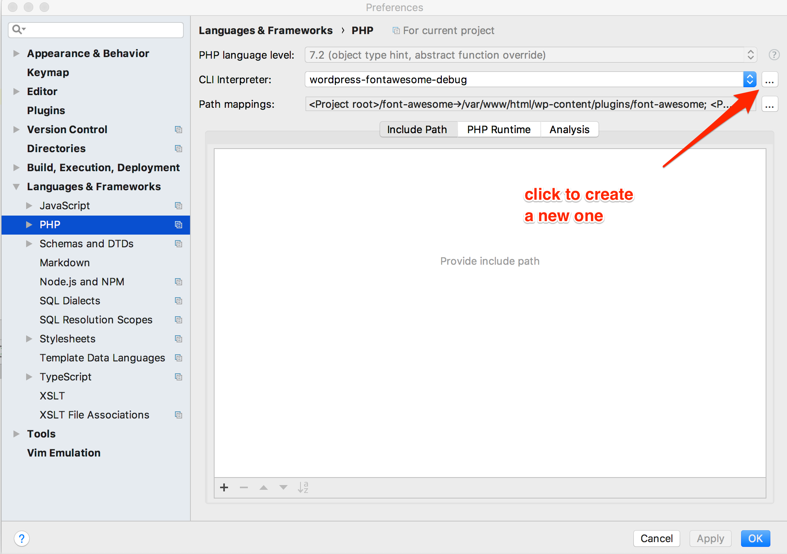
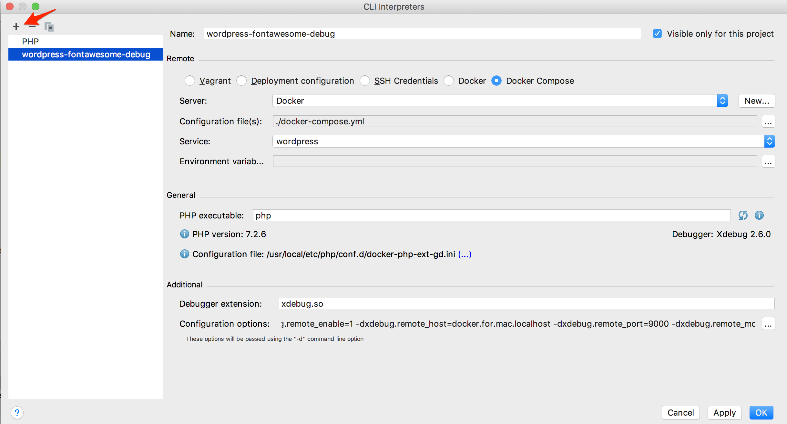
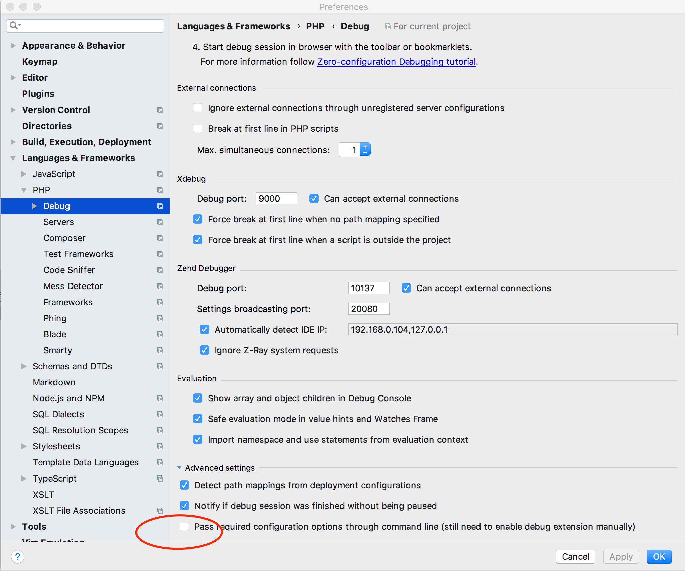
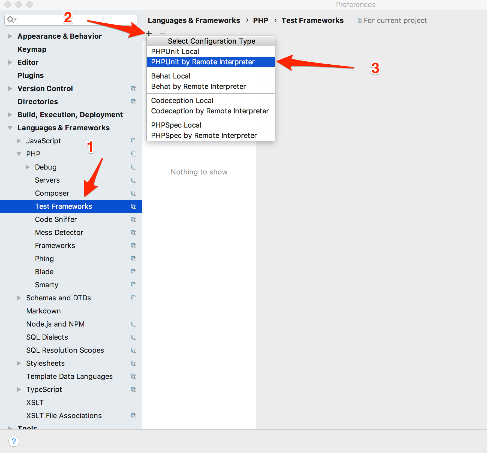
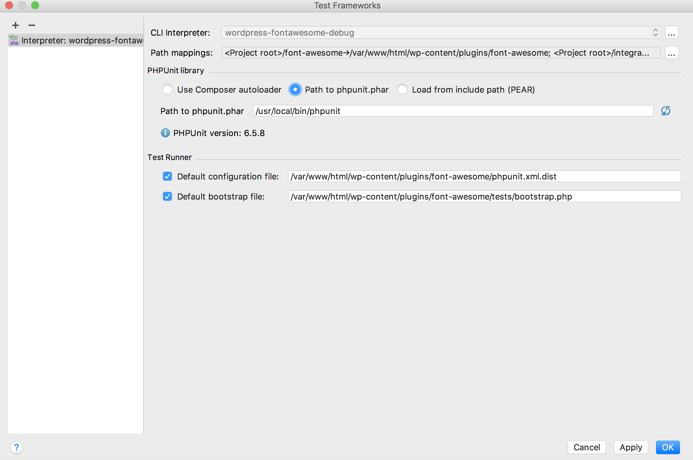
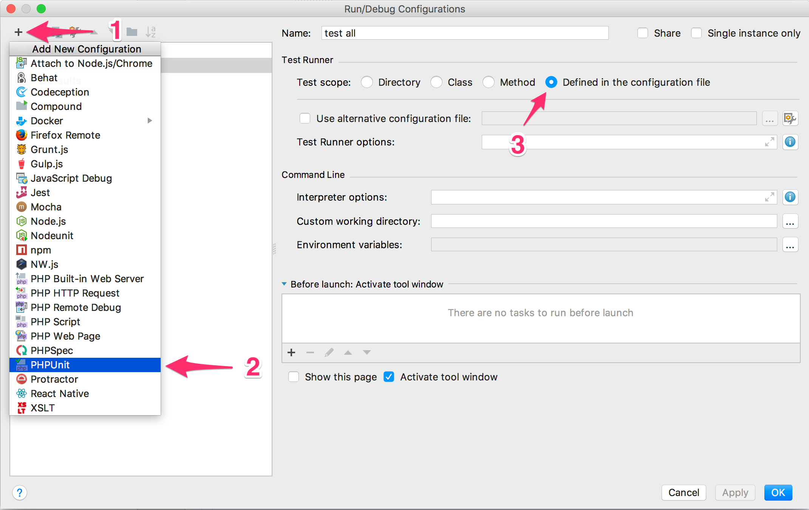
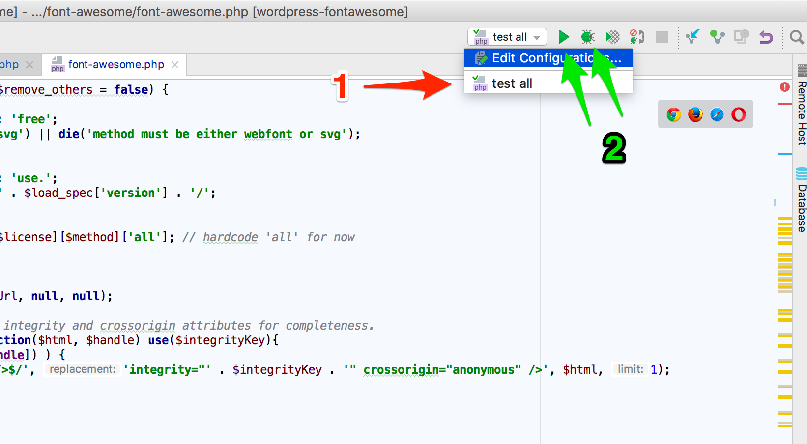

# First-time Setup for Development
1. Make sure Docker is installed
2. docker-compose up
3. create a .env.email file with an admin email address WordPress can use:

```
WP_ADMIN_EMAIL=some_real_address@example.com
```

4. install composer (PHP package manager)

On Mac OS X, it can be installed via `brew install composer`

5. update composer dependencies: `composer install`

6. run `./bin/setup`

This does the initial admin setup that happens first on any freshly installed WordPress
site. Just doing it from the command line for convenience.

It also adds some configs to `wp-config.php` for debugging: `WP_DEBUG`, `WP_DEBUG_LOG`, `WP_DEBUG_DISPLAY`.

WordPress is now ready and initialized in the docker container and reachable at localhost:8000
with admin username and password as found in `.env`.

To access the WP Admin dashboard, go to `http://localhost:8000/wp-admin`.

# Reset WordPress Docker Environment and Remove Data Volume

`./bin/clean`

This will kill and remove docker containers and delete the data volume.

# Use wp-cli with the Dockerized WordPress Instance

`./bin/wp`

# Activate and Deactivate Plugin from Command Line

`./bin/wp plugin activate font-awesome`

`./bin/wp plugin deactivate font-awesome`

It can also be managed on the WP Admin Interface on the Plugins page

# Activate Integration Test Plugin and Theme

There's a `plugin-beta` and a `theme-alpha` that each are clients of this `font-awesome` plugin.
They are not involved in the unit test suite at all. But when you're playing with the with localhost:8000,
you'll probably want to activate these to see something happen.

They can be activated from WP Admin Dashboard as any Plugin or Theme would be, or from the command line:

`./bin/wp plugin activate plugin-beta`

`./bin/wp theme activate theme-alpha`

# Run phpunit

`./bin/phpunit`

# Set a boolean config in wp-config.php

`./bin/set-wp-config WP_DEBUG true`

(Though this particular config is already set bin `bin/setup`.)

# Configure PhpStorm 2018.1.5 for debugging in the container

1. Add a CLI interpreter

Preferences -> Languages & Frameworks -> PHP



Add a new CLI interpreter with Docker Compose. We'll call it `wordpress-fontawesome-debug`.



* Enter `./docker-compose.yml` for the configuration file.
* Service: `wordpress`
* PHP Executable: php
* Debugger extension: xdebug.so
* Configuration options:
  * xdebug.remote_enable=1
  * xdebug.remote_host=docker.for.mac.localhost
  * xdebug.remote_port=9000
  * xdebug.remote_mode=jit

2. Configure Debugging

The defaults may be fine, but the key is to uncheck the option circled in the screenshot.

[See also](https://intellij-support.jetbrains.com/hc/en-us/community/posts/360000229624-Setting-up-xDebug-with-PHPUnit-using-Docker-for-Mac-and-PHPStorm)



3. Configure Test Framework

Our test framework is PHPUnit, and it will run "remotely", because it's in a Docker container.





* CLI Interpreter: select the one we created previously.
* Path mappings: these should be auto-populated, based on the `docker-compose.yml` being used by our CLI interpreter. If not, then look at the `docker-compose.yml`
  to guide you in setting up path mappings. For example, your host directory `/Users/you/repos/wordpress-fontawesome/font-awesome` should map to container
  directory `/var/www/html/wp-content/plugins/font-awesome`.
* Path to phpunit.phar: this should be the full path _inside_ the container.
* Default configuration file and Default bootstrap file: these are also full paths _inside_the container.


4. Create Run and Test Configurations

(Menu) Run -> Edit Configurations...

For running and debugging tests:



This is where you can configure which tests run when you invoke this test runner. You could create more than one test configuration
for conveniently running different test groups. In this pictured configuration, we're just using the test configuration file that
  we previosly configured for use by the Test Framework.

To run that run configuration, you can select it here (red arrow) and then either run it normally or run it under debugging (green arrows):



## Gotcha: `wordpress-fontawesome_phpstorm_helpers_1` container fails to start

It may throw an error like "network \<some_big_hex_value\> not found".

This happens, apparently, when _after_ you initially set up this configuration, you change the network id for the Docker Compose compose container.
And this could happen if you ran `docker-compose down` or ran the local `bin/clean`. These tear down the network as well as the container.
But PhpStorm creates a `php_helper` container and associates it wih this network. So if you remove the network, it will fail miserably.

A solution is just to remove that container and then try again in PhpStorm. It will just recreate that helper container and  associate it with the
new `docker-compose` network.

There's more than one way to delete that container, but one way is to find the container's name and run:
* `docker container stop wordpress-fontawesome_phpstorm_helpers_1`
* `docker container rm wordpress-fontawesome_phpstorm_helpers_1`

# Development Roadmap

- Test that it works no matter the order in which plugins are loaded.

- Add diagnostic output to Admin settings page that shows what other attempts to load Font Awesome may have
  happened outside of our control and which probably produce runtime conflicts.

- Populate lists like "versions available" from a REST endpoint yet to be built.
